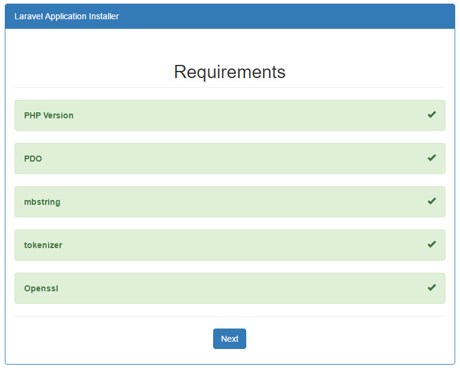
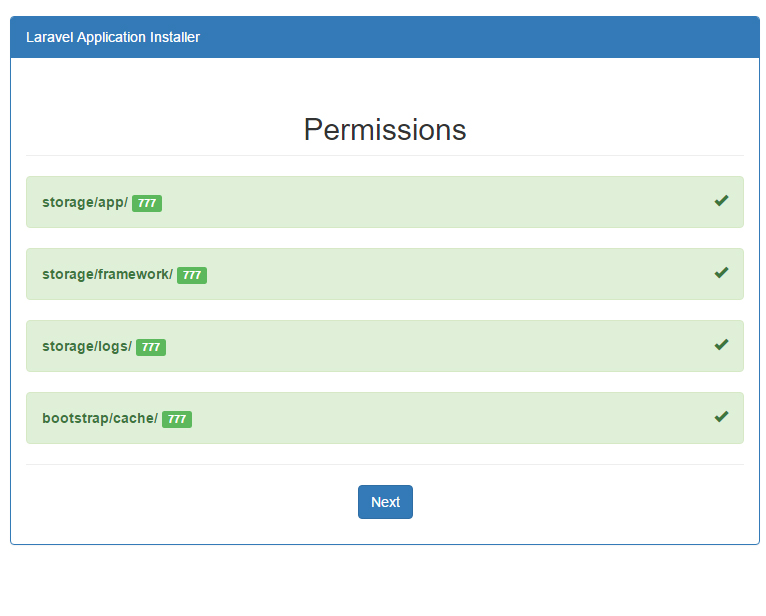
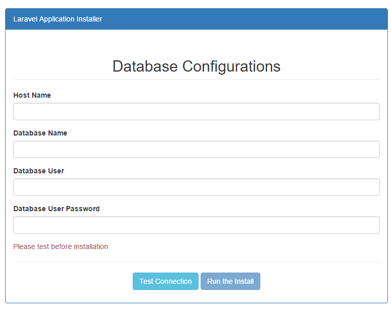

# Laravel Application Installer
Laravel Application Installer will let you to install a laravel project on any server in a GUI Interface Wizard like WordPress
The key features are:

	- Checks PHP Version.
	- Checks PDO.
	- Checks mbstring.
	- Checks tokenizer.
	- Checks Openssl.
	- Checks Openssl.
	- Checks Folder Permissions.
	- Test Database Connection before Migrating.
	- Migrate The Database.
	- Seed The Tables.

If you have any suggestions please let us know : https://najeebmedia.com.

## Installation

Open .env file of the project and set following values like this

```
DB_DATABASE=_DB_NAME_
DB_USERNAME=_DB_USER_
DB_PASSWORD=_DB_PASS_
```

Then, copy the install directory in root of project, and navigate to project/install

Make sure to delete the install directory after successfull installation.

## Requirements

```
Laravel 5.3
PHP 5.5.4
```

## Screenshots




